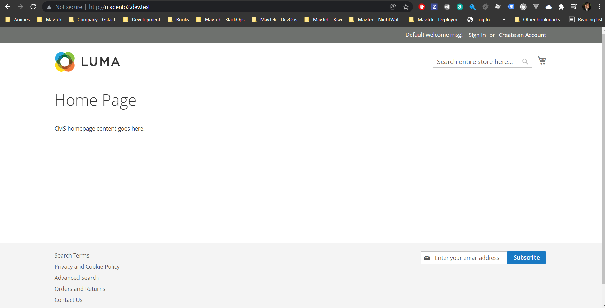

# Catching UP - Magento2

# Learnings
- Quick Install: https://devdocs.magento.com/guides/v2.4/install-gde/composer.html

# Creating a new project
`composer create-project --repository-url=https://repo.magento.com/ magento/project-enterprise-edition=2.4.0 <install-directory-name>
 `

# Running and build
`docker-compose up --build --force-recreate --remove-orphans
`

# Magento UP
